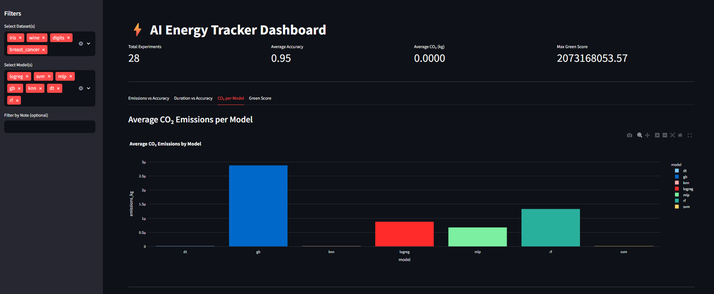

# Green-AI-Insights

Interactive dashboard analyzing AI experiments’ performance and carbon footprint to promote sustainable machine learning practices.

## Problem Statement

The increasing complexity and scale of AI models have led to a significant rise in energy consumption and carbon emissions. Training these models often requires substantial computational resources, contributing to environmental concerns. There is a need for tools that can help researchers and practitioners understand and mitigate the environmental impact of their AI experiments.


## Introduction 

Green-AI-Insights is an interactive dashboard designed to analyze the performance and carbon footprint of AI experiments. It aims to promote sustainable machine learning practices by providing insights into the environmental impact of different AI models and training techniques.

## Features

-   **Performance Analysis**: Evaluate the performance metrics of AI experiments.
-   **Carbon Footprint Tracking**: Monitor and analyze the carbon footprint associated with AI training.
-   **Interactive Dashboard**: User-friendly interface for visualizing experiment data.
-   **Sustainable Practices**: Encourages the adoption of environmentally friendly machine learning techniques.

## Installation

To install and run Green-AI-Insights, follow these steps:

1.  Clone the repository:

    ```bash
    git clone https://github.com/mekhushi/Green-AI-Insights.git
    cd Green-AI-Insights
    ```

2.  Install the required dependencies:

    ```bash
    pip install -r requirements.txt
    ```

## Usage

1.  Prepare your AI experiment data and place it in the `data/` directory.
2.  Run the Streamlit application:

    ```bash
    streamlit run src/app.py
    ```

3.  Access the dashboard through your web browser at the address provided in the console output (usually `http://127.0.0.1:8050/`).
  

## Data

The `data/` directory is intended to store the datasets and experiment results that will be analyzed by the dashboard. Ensure your data is properly formatted for compatibility with the analysis scripts.

## Contributing

Contributions are welcome! Here’s how you can contribute:

1.  Fork the repository.
2.  Create a new branch for your feature or bug fix.
3.  Implement your changes and test thoroughly.
4.  Submit a pull request with a clear description of your changes.

## License

This project is licensed under the MIT License - see the [LICENSE](LICENSE) file for details.
